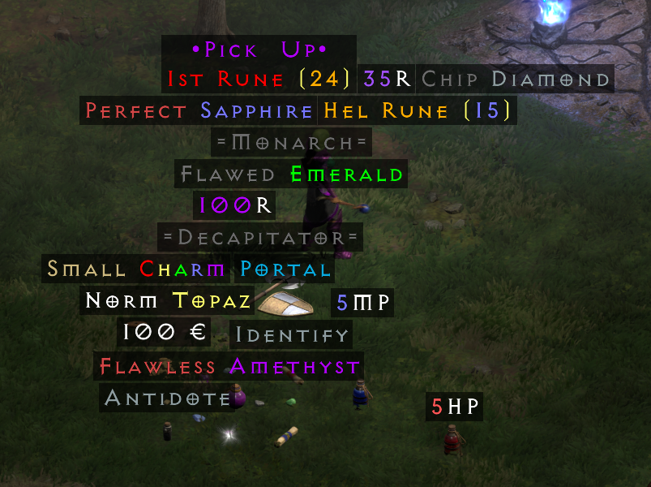
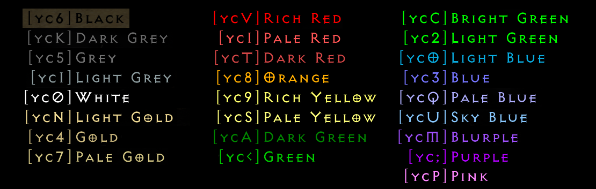

# Custom D2R Lootfilter

## Installation
* Extract the `Filter` folder to `<D2R-Directory>\mods` (create the `mods` folder if it does not exist yet)
* add the following to your D2R "Additional Command Line Arguments"  
  `-mod Filter -txt`
## Changes
These are the changes I made from the [source](https://www.nexusmods.com/diablo2resurrected/mods/205)

- Switched priority on socketed/ethereal items  
  If an item is socketed and ethereal, the socketed color is shown.
- Change `Gold` text to `€`  
  Shorter and easier to see for me
- Disabled coloring of item modifiers when hovering over an item  
  like `+x All Resistances`
- Changed coloring and text of gems  
  Normal gems are colored as well, but this leads to some rare item affixes being colored as well.  
  An acceptable tradeoff for me.  
- Color Arrows and Bolts black, making them almost invisible.
- Customize colors & text for scrolls & potions
- Make charms rainbow colored & fix coloring for Annihilus and Hellfire Torch

## Customization
You can easily change the text and colors by looking for the strings in the mod files and replacing them with your own text/colors.

To make something colored take the color code and prefix the portion of string you want to color.  
For example `ÿc5Flawed ÿc2Emerald` will produce the Flawed Emerald text as pictured above.

Here is a current list of colors (Feb, 2026)

If you want to customize even more things, that are not available in the files in this mod, you can extract the original files from the game files using [Ladik’s Casc View](https://diabloclone.org/downloads/cascview_en_v2.3.0.246.zip), put them in the corresponding path in the mod files and then edit them.
